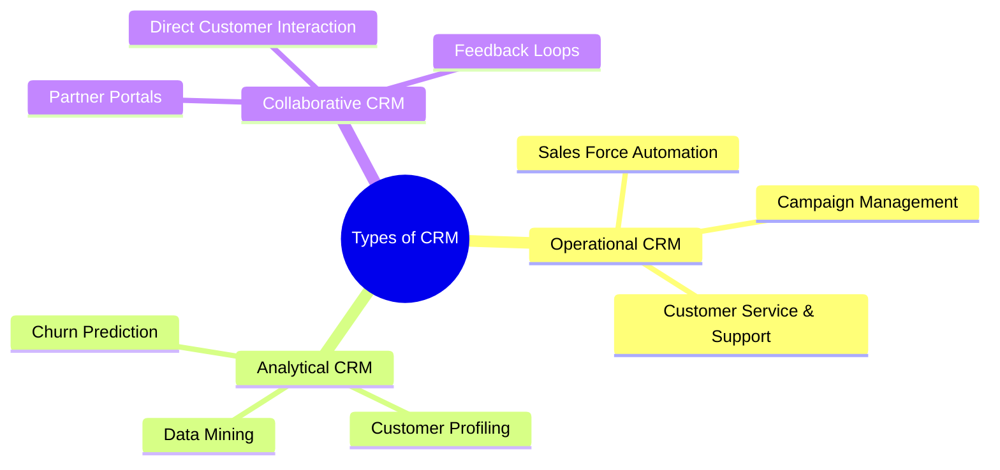
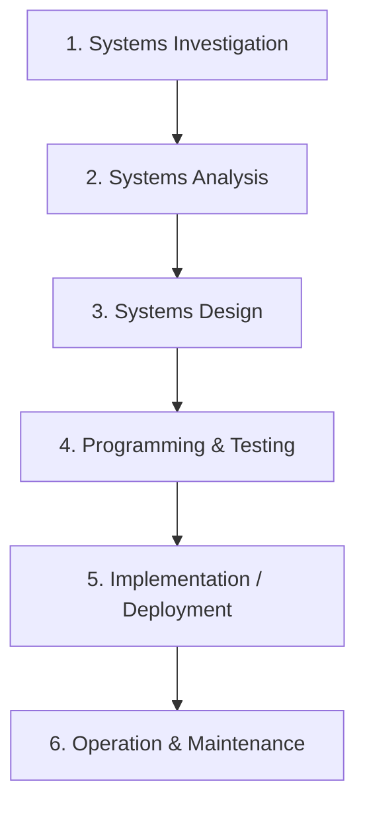

# Management Information Systems (MIS) - MU Sem 7 Unit Test 2 (PT-2) 🚀
*Mumbai University | Sem 7 Computer Engineering | Thadomal Shahani Engineering College*

---

## Part A: Question Bank Analysis & Past Trends 📊

### Exam Pattern Analysis
*   **Total Marks:** 20 Marks
*   **Duration:** 1 Hour
*   **Typical Structure:** Q1 is usually compulsory. Followed by internal choices covering E-Commerce, ERP/CRM, and System Development.
*   **Marking Scheme:** MU favors structured answers. Always start with a definition, followed by explanation, formula/diagram, and examples.

### Question Priority Matrix
| Priority | Question Topics | Focus Area | Pattern |
| :--- | :--- | :--- | :--- |
| 🔴 **HIGHEST** | Q4, Q9, Q10 | ERP Systems, TPS, Batch vs OLTP | Core Concepts & Comparisons |
| 🟠 **HIGH** | Q3, Q6, Q7 | CRM Types, Traditional SDLC, TPS Example | Theory + Diagrams |
| 🟡 **MEDIUM** | Q1, Q5, Q8 | E-Commerce Models, Prototyping vs SDLC, FAIS | Process & Classifications |
| 🟢 **STANDARD**| Q2, Q11, Q12 | M-Commerce, MIS Reports, Social Computing | Short Notes |

> [!TIP]
> **Exam Strategy:** Questions like Q7, Q9, and Q10 overlap heavily on the concept of **TPS (Transaction Processing Systems)**. Mastering TPS, ERP, and FAIS will cover nearly 40% of the exam's weightage. Always draw the SDLC flowchart if Q5 or Q6 is asked!

---

## Part B: Complete Answers 📝

### Q1) Explain B2B, B2C, C2C, B2E electronic commerce with example.

**Definition:** Electronic Commerce (e-commerce) is the process of buying, selling, transferring, or exchanging products, services, or information via computer networks, including the Internet.

1.  **B2B (Business-to-Business):**
    *   **Explanation:** Transactions conducted directly between two businesses. It accounts for the vast majority of e-commerce volume. It involves supply chain management, procurement, and wholesale.
    *   **Example:** Intel selling microprocessors to Dell; Alibaba connecting wholesale manufacturers with retailers.
2.  **B2C (Business-to-Consumer):**
    *   **Explanation:** Businesses selling directly to the end consumers. It involves electronic retailing (e-tailing) and is the most visible form of e-commerce.
    *   **Example:** A consumer buying a laptop from Amazon or ordering clothes from Myntra.
3.  **C2C (Consumer-to-Consumer):**
    *   **Explanation:** Consumers selling directly to other consumers. These platforms act as intermediaries to match buyers and sellers.
    *   **Example:** Selling a used smartphone on OLX or auctioning vintage items on eBay.
4.  **B2E (Business-to-Employee):**
    *   **Explanation:** An organization using e-commerce internally to provide information and services to its employees.
    *   **Example:** Employees managing their health insurance, applying for leaves, or purchasing discounted company products via an internal corporate portal.

---

### Q2) Write short notes on: 1. e-Commerce 2. M-Commerce

*Note: The question bank leaves the 3rd point blank. Here are comprehensive notes on the first two.*

**1. E-Commerce (Electronic Commerce):**
*   **Definition:** The buying and selling of goods and services over the internet.
*   **Key Features:** Global reach, 24/7 availability, lower operational costs, and disintermediation (removing the middleman).
*   **Types:** B2B, B2C, C2C, B2E, and G2C (Government to Citizen).
*   **Impact:** Has revolutionized traditional retail, created new business models (dropshipping, subscriptions), and enabled global supply chains.

**2. M-Commerce (Mobile Commerce):**
*   **Definition:** Electronic commerce transactions conducted in a wireless environment, especially via mobile devices (smartphones, tablets).
*   **Key Features:**
    *   **Ubiquity:** Can be accessed anywhere, anytime.
    *   **Localization:** Location-based services via GPS (e.g., finding nearby restaurants).
    *   **Personalization:** Mobile devices are highly personal, allowing for targeted marketing.
*   **Examples:** Using Apple Pay or Google Pay, ordering an Uber, or banking via a mobile app.

---

### Q3) Define CRM. Describe the different types of CRM.

**Definition:** 
Customer Relationship Management (CRM) is a customer-focused organizational strategy designed to optimize profitability, revenue, and customer satisfaction by focusing on highly defined and precise customer groups.

**Types of CRM:**

1.  **Operational CRM:**
    *   **Purpose:** Supports front-office business processes that directly interact with customers (sales, marketing, and service).
    *   **Components:** 
        *   *Customer-facing applications:* Sales force automation (SFA), customer service/support centers.
        *   *Customer-touching applications:* e-commerce websites, FAQs, automated response systems.
2.  **Analytical CRM:**
    *   **Purpose:** Analyzes customer data collected by Operational CRM to provide actionable business intelligence.
    *   **Applications:** Designing targeted marketing campaigns, identifying customer churn, cross-selling/up-selling, and financial forecasting. It heavily uses data warehousing and data mining.
3.  **Collaborative CRM:**
    *   **Purpose:** Integrates communications between the organization and its customers in all aspects (marketing, sales, and support). 
    *   **Applications:** Allows customers to provide direct feedback, enabling businesses to involve customers in product design and service improvements.

---

### Q4) What do you understand by ERP systems. Give the benefits and limitations of ERP Systems.

**Definition:**
Enterprise Resource Planning (ERP) systems integrate the planning, management, and use of all organizational resources (data, processes, people) across all functional areas into a single, unified software platform.

**Core Concept:** ERP breaks down "information silos." Instead of HR, Finance, and Marketing having separate databases, ERP provides a **single, centralized database**.

**Benefits of ERP Systems:**
1.  **Organizational Flexibility and Agility:** Breaks down departmental silos, making the company more agile and adaptive to market changes.
2.  **Decision Support:** Provides a unified, real-time view of data across the enterprise, vastly improving management decision-making.
3.  **Quality and Efficiency:** Integrates and improves business processes (best practices), leading to higher quality and efficiency in production, distribution, and customer service.
4.  **Data Security:** Centralized data storage with standardized backup and access control mechanisms.

**Limitations of ERP Systems:**
1.  **High Cost & Time:** Very expensive to purchase and implement; implementations can take months or years.
2.  **Forces Business Process Changes:** Companies often have to change their existing business processes to fit the "best practices" built into the ERP software.
3.  **Complex Implementation:** High risk of implementation failure due to employee resistance (change management issues) and technical complexity.
4.  **Vendor Lock-in:** Once an ERP (like SAP or Oracle) is integrated, it is extremely difficult and costly to switch to another vendor.

---

### Q5) Explain prototype and life cycle approach in development of MIS

When developing an MIS, organizations typically choose between a structured approach (Life Cycle) or an iterative approach (Prototyping).

| Feature | Life Cycle Approach (SDLC) | Prototyping Approach |
| :--- | :--- | :--- |
| **Definition** | A structured, step-by-step sequential process for developing systems. | An iterative process of building a quick, working model of the system for user feedback. |
| **Best Used When** | Requirements are well-understood, clear, and fixed at the start. Systems are large and complex. | Requirements are unclear, changing, or hard to visualize. Systems are smaller or highly interactive. |
| **Flexibility** | Rigid. Hard to go back and change requirements once a phase is passed. | Highly flexible. The prototype evolves continuously based on user feedback. |
| **User Involvement** | High during initial requirements gathering, low during development. | Very high throughout the entire process. Users test and refine the prototype constantly. |
| **Time & Cost** | Generally takes longer and is more expensive upfront. | Quick initial delivery, but can become expensive if endless iterations occur. |

---

### Q6) Explain traditional system development life cycle (SDLC).

**Definition:** The System Development Life Cycle (SDLC) is the traditional systems development method that organizations use for large-scale IT projects. It is a structured framework that consists of sequential processes.

**Phases of SDLC:**
1.  **Systems Investigation:** Understanding the business problem. The main outcome is the **feasibility study** (technical, economic, and behavioral feasibility) to decide whether to proceed ("Go/No-Go" decision).
2.  **Systems Analysis:** Gathering business requirements from users. Answering the question: *What must the system do?*
3.  **Systems Design:** Designing the technical specifications that will satisfy the requirements. Answering the question: *How will the system do it?* (Includes UI design, database design, system architecture).
4.  **Programming and Testing:** Translating the design specifications into computer code. Testing checks if the code produces the expected results under various conditions (Unit, Integration, and System testing).
5.  **Implementation:** The process of converting from an old system to a new one. (Conversion strategies: Direct cutover, Pilot, Phased, or Parallel).
6.  **Operation and Maintenance:** Once deployed, the system is monitored, debugged, and updated to accommodate changes in business conditions.

---

### Q7) Define Transaction Processing System (TPS). Explain in detail with an example.

**Definition:**
A Transaction Processing System (TPS) is an information system that supports the monitoring, collection, storage, and processing of data generated by the organization's basic business transactions. 

**Detailed Explanation:**
*   **Role:** It is the backbone of an organization's IT infrastructure. It collects data continuously, in real-time.
*   **Characteristics:** High volume of data, high speed, accuracy, and reliability. It must handle concurrent processing and ensure data integrity (ACID properties).
*   **Input to other systems:** The data collected by a TPS serves as the foundation (input) for higher-level systems like FAIS, MIS, and DSS.

**Example: Point-of-Sale (POS) System at a Supermarket**
When a customer buys groceries, the cashier scans the barcodes.
1.  **Collection:** The barcode scanner captures the item ID.
2.  **Processing:** The TPS fetches the price from the database, calculates the total, applies taxes, and processes the credit card payment.
3.  **Storage:** The transaction record is saved in the database.
4.  **Outcome:** A receipt is printed for the customer, and the inventory count for those items is instantly decremented in the database.

---

### Q8) Define a Functional Area Information System (FAIS). Explain each FAIS in detail.

**Definition:**
Functional Area Information Systems (FAIS) are designed to support a specific functional area (department) within an organization by increasing its internal effectiveness and efficiency. 

**Detailed FAIS Types:**

1.  **Information Systems for Accounting and Finance:**
    *   **Function:** Manages the inflow and outflow of organizational assets.
    *   **Activities Supported:** Financial planning and budgeting, managing financial transactions (accounts payable/receivable), investment management, and auditing.
2.  **Information Systems for Marketing and Sales:**
    *   **Function:** Helps understand customer needs and sell products.
    *   **Activities Supported:** Customer relationship management (CRM), targeted advertising, pricing strategies, sales forecasting, and managing the sales pipeline.
3.  **Information Systems for Production/Operations Management (POM):**
    *   **Function:** Transforms inputs (raw materials) into outputs (finished goods).
    *   **Activities Supported:** Supply chain management, inventory management, quality control, Just-In-Time (JIT) systems, and Computer-Aided Manufacturing (CAM).
4.  **Information Systems for Human Resource Management (HRIS):**
    *   **Function:** Manages the organization's workforce.
    *   **Activities Supported:** Recruitment (tracking applicants), employee record maintenance, payroll processing, benefits administration, and performance evaluations.

---

### Q9) Write short notes on: 1. ERP 2. TPS 3. FAIS

**1. Enterprise Resource Planning (ERP):**
ERP systems integrate all departments and functional areas of an organization into a single IT system (unified database). This breaks down information silos, allows real-time data sharing across the company, enforces best practices, and drastically improves management decision-making. (Examples: SAP, Oracle).

**2. Transaction Processing System (TPS):**
TPS is the operational-level system that captures and processes detailed data necessary to update the organization's records about fundamental business operations. It handles high volumes of routine, repetitive tasks reliably and accurately. (Examples: ATM systems, Retail POS, Airline reservation systems).

**3. Functional Area Information System (FAIS):**
FAIS provides information to lower- and middle-level managers in specific departments (like HR, Marketing, Finance, or Operations) to help them plan, organize, and control their operations. Unlike ERP, traditional FAIS are often standalone "silos" that serve only their specific department.

---

### Q10) Define Transaction Processing System. What do you understand by batch processing and OLTP.

**Definition of TPS:** A Transaction Processing System (TPS) collects, stores, modifies, and retrieves the day-to-day data transactions of an enterprise.

A TPS processes data in one of two basic ways:

| Feature | Batch Processing | Online Transaction Processing (OLTP) |
| :--- | :--- | :--- |
| **Definition** | Transactions are collected over time and processed together in batches at scheduled intervals. | Transactions are processed online, immediately as they occur, in real-time. |
| **Processing Speed** | Delayed. Processed daily, weekly, or monthly. | Instantaneous / Real-time. |
| **Resource Usage** | Uses computer resources when they are least busy (e.g., overnight). | Requires constant, dedicated computing resources to handle unpredictable loads. |
| **Data Currency** | Data is only accurate up to the time of the last batch run. | Database is always 100% up-to-date reflecting current reality. |
| **Best Used For** | Large volumes of routine data where real-time accuracy isn't critical. | Situations where immediate confirmation is required. |
| **Example** | Payroll processing (run at the end of the month), Bank cheque clearances overnight. | ATM cash withdrawals, Flight ticket bookings, E-commerce checkouts. |

---

### Q11) Explain different types of MIS Reports with an example.

Management Information Systems (MIS) primarily generate reports for middle managers to evaluate organizational performance. 

1.  **Routine (Scheduled) Reports:**
    *   **Explanation:** Produced at scheduled intervals (daily, weekly, monthly).
    *   **Example:** A Daily Sales Report generated every midnight showing total revenue for the day.
2.  **Ad-hoc (On-Demand) Reports:**
    *   **Explanation:** Non-routine reports generated for a specific, unplanned situation or request by a manager. Includes drill-down, key-indicator, and comparative reports.
    *   **Example:** A manager asking for a report on "Sales of laptops in Mumbai specifically during the Diwali weekend of 2025."
3.  **Exception Reports:**
    *   **Explanation:** Includes only information that falls outside certain threshold standards. They highlight unusual situations requiring management action.
    *   **Example:** A report listing only those products whose inventory level has dropped below the minimum reorder threshold (ignoring products with healthy stock).

---

### Q12) Discuss the significance of social computing in business in detail.

**Definition:** Social computing is the delivery of electronic commerce activities and transactions through social computing and Web 2.0 technologies (social media, wikis, blogs).

**Significance in Business:**

1.  **Marketing and Customer Interaction (Social Commerce):**
    *   Businesses use platforms like Instagram, Facebook, and Twitter to build brand awareness and interact directly with consumers. 
    *   *Significance:* Enables highly targeted advertising, viral marketing campaigns, and instant customer feedback.
2.  **Customer Relationship Management (Social CRM):**
    *   Organizations monitor social media to understand customer sentiment and respond to complaints rapidly.
    *   *Significance:* Customers feel heard. Resolving a complaint publicly on Twitter can boost brand reputation significantly.
3.  **Human Resources and Recruiting:**
    *   HR departments heavily utilize professional networks like LinkedIn to source talent, verify backgrounds, and recruit passive candidates.
    *   *Significance:* Reduces hiring costs and helps find highly specialized talent that wouldn't respond to traditional job boards.
4.  **Internal Collaboration and Knowledge Management:**
    *   Companies use internal enterprise social networks (like Slack, Microsoft Teams, or corporate wikis).
    *   *Significance:* Breaks down geographical barriers, fosters team collaboration, and captures institutional knowledge that would otherwise be lost in email threads.
5.  **Crowdsourcing:**
    *   Businesses use social platforms to outsource tasks or gather ideas from a large, undefined group of people.
    *   *Significance:* Accelerates innovation (e.g., Lego Ideas platform) and reduces R&D costs.

---

## Part C: Quick Revision Cheat Sheet ⚡

### 🧠 One-Liner Concept Summaries
*   **E-Commerce Models:** B2B (Business-Business), B2C (Business-Consumer), C2C (Consumer-Consumer).
*   **M-Commerce:** E-commerce on mobile (Anywhere, Anytime).
*   **CRM (Customer Relationship Management):** Strategy to manage customer lifecycles (Operational, Analytical, Collaborative).
*   **ERP (Enterprise Resource Planning):** One central database replacing departmental silos (expensive but efficient).
*   **SDLC vs Prototyping:** SDLC = Strict step-by-step; Prototyping = Build fast, get feedback, iterate.
*   **TPS (Transaction Processing System):** The foundation system that captures raw daily transactions (e.g., POS).
*   **Batch vs OLTP:** Batch = Processed later in groups (Payroll); OLTP = Processed instantly (ATM).
*   **FAIS:** Systems specific to a single department (HR, Finance).
*   **Exception Reports:** Only shows things that went wrong or need immediate attention.
*   **Social Computing:** Using Web 2.0/Social Media for CRM, marketing, and HR.

### ⚠️ Common Exam Mistakes to Avoid
1.  **Mixing up ERP and FAIS:** Remember, FAIS is for *one* specific department (siloed). ERP integrates *all* departments together into one database.
2.  **Confusing Operational vs Analytical CRM:** Operational is front-office (talking to customers/sales). Analytical is back-office (data mining, predicting behavior).
3.  **Forgetting SDLC Steps:** Memorize the acronym **I-A-D-P-I-M** (Investigation, Analysis, Design, Programming/Testing, Implementation, Maintenance).
4.  **Batch vs OLTP:** Don't just say one is fast and one is slow. Specify that Batch is grouped and scheduled, while OLTP handles real-time concurrency.
