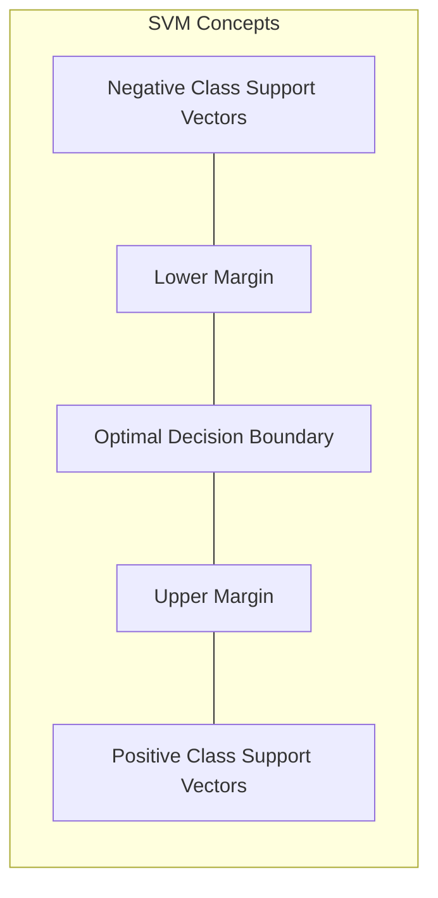

# Machine Learning (CSL701) - MU Sem 7 Unit Test 2 (PT-2) 🚀
*Mumbai University | Sem 7 Computer Engineering | Thadomal Shahani Engineering College*

---

## Part A: Question Bank Analysis & Past Trends 📊

### Exam Pattern Analysis
*   **Total Marks:** 20 Marks
*   **Duration:** 1 Hour
*   **Focus Areas:** This Unit Test is **HEAVILY NUMERICAL**. You must bring a scientific calculator.
*   **Key Algorithms:** Support Vector Machines (SVM), Linear Discriminant Analysis (LDA), Principal Component Analysis (PCA), Singular Value Decomposition (SVD), DBSCAN, and Expectation-Maximization (EM).

### Question Priority Matrix
| Priority | Question Topics | Focus Area | Pattern |
| :--- | :--- | :--- | :--- |
| 🔴 **HIGHEST** | Q3, Q4, Q5, Q10 | SVM, LDA, PCA | Hard Numericals (Step-by-step required) |
| 🟠 **HIGH** | Q6, Q8, Q9 | SVD, DBSCAN, EM Algorithm | Mid-level Numericals |
| 🟡 **MEDIUM** | Q7, Q12 | PCA Steps, EM Theory | Algorithmic Steps |
| 🟢 **STANDARD**| Q1, Q2, Q11 | SVM Terminology, Kernels, DBSCAN Note | Short Theory + Diagrams |

> [!CAUTION]
> **Exam Strategy:** Do NOT skip the numericals! LDA, PCA, and SVM calculations will guarantee full marks if your steps are correct. Keep your calculations to 3 decimal places for precision.

---

## Part B: Complete Answers 📝

### Q1) Explain the following terminologies with the help of appropriate illustrations: i. Optimal Decision Boundary ii. Support vectors iii. Margins

**i. Optimal Decision Boundary (Hyperplane):**
*   It is the separating line (in 2D) or plane (in higher dimensions) that divides the data points of different classes.
*   The *optimal* decision boundary is the one that maximizes the distance (margin) between the classes, ensuring the best generalization for unseen data.

**ii. Support Vectors:**
*   These are the data points that lie closest to the decision surface (on the margin boundaries).
*   They are the most difficult data points to classify and directly "support" or define the placement of the optimal hyperplane. Moving or deleting them would change the position of the decision boundary.

**iii. Margins:**
*   The margin is the distance between the optimal decision boundary and the closest data points (support vectors) of either class.
*   SVM aims to find the **Maximum Margin Hyperplane**. A larger margin represents greater confidence in the classification.

*(In the exam, draw a 2D scatter plot with a solid line in the middle for the decision boundary, and two dotted lines parallel to it touching the closest points. Label the closest points as Support Vectors, the gap as Margin, and the middle line as the Optimal Decision Boundary).*

---

### Q2) What are kernel functions? List some kernel functions. What is their use in SVM?

**Definition:** 
A Kernel function is a mathematical trick used in Support Vector Machines (SVM) that takes data as input and transforms it into the required form, mapping it to a higher-dimensional space.

**Use in SVM (The Kernel Trick):**
When data points are not linearly separable in their original input space (e.g., they form concentric circles), a linear decision boundary cannot separate them. The Kernel function projects these points into a higher-dimensional feature space where they *become* linearly separable by a simple hyperplane, without actually computing the coordinates in that higher space (which saves massive computational power).

**List of Common Kernel Functions:**
1.  **Linear Kernel:** Used when data is already linearly separable. $K(x, y) = x^T y$
2.  **Polynomial Kernel:** Maps to polynomial feature spaces. $K(x, y) = (\alpha x^T y + c)^d$
3.  **RBF (Radial Basis Function) / Gaussian Kernel:** Most popular, handles highly non-linear data. $K(x, y) = \exp(-\gamma ||x - y||^2)$
4.  **Sigmoid Kernel:** Often used as a proxy for neural networks.

---

### Q3) Obtain the Optimal Binary hyperplane for classifying the data points:
**+ve class: {(1,1), (3,1), (1,4)}**
**-ve class: {(2,4), (3,3), (5,1)}**

**Step 1: Plotting and identifying Support Vectors**
If we plot these points, we notice that the positive class points lie closer to the origin, while the negative class points are further out.
*   Let's test the line $x + y = c$.
*   For +ve points: (1,1)$\rightarrow2$; (3,1)$\rightarrow4$; (1,4)$\rightarrow5$. (Max value is 5).
*   For -ve points: (2,4)$\rightarrow6$; (3,3)$\rightarrow6$; (5,1)$\rightarrow6$. (Min value is 6).

Notice that all -ve points lie exactly on the line **$x + y = 6$**. 
The closest +ve point lies on the line **$x + y = 5$**.

**Step 2: Margin Boundaries**
*   Positive Margin Boundary: $x + y = 5$
*   Negative Margin Boundary: $x + y = 6$
*   The Support Vectors are **(1,4)** for the +ve class, and **(2,4), (3,3), (5,1)** for the -ve class.

**Step 3: Optimal Hyperplane**
The optimal decision boundary lies exactly midway between the margin boundaries:
Midway between $c=5$ and $c=6$ is $c=5.5$.
Equation: **$x + y = 5.5$** or **$2x + 2y - 11 = 0$**

**Step 4: Finding parameters $w$ and $b$ (Standard SVM Format)**
SVM format: $w_1x + w_2y + b = \pm 1$
We want $w^Tx + b \ge 1$ for +ve class (since $x+y$ is smaller for +ve class, we need to multiply by negative weights to flip the inequality).
Let:
$w_1(x) + w_2(y) + b = 1$ for +ve SV (1,4)
$w_1(x) + w_2(y) + b = -1$ for -ve SV (2,4)
Subtracting: $w_1(1-2) + w_2(4-4) = 2 \implies -w_1 = 2 \implies w_1 = -2$.
Because of symmetry ($x+y$), $w_2 = -2$.
Substitute into +ve SV equation: $-2(1) - 2(4) + b = 1 \implies -10 + b = 1 \implies b = 11$.

**Final Answer:**
*   Optimal Binary Hyperplane: **$2x + 2y - 11 = 0$**
*   Weight vector $w = [-2, -2]^T$, bias $b = 11$.

---

### Q4) Given +ve labelled points {(3,1), (3,-1), (6,1), (6,-1)} and -ve labelled points {(1,0), (0,1), (0,-1), (-1,0)}. Find parameters of decision boundary using SVM and classify (1,3).

**Step 1: Identify the Support Vectors**
*   The +ve points form a rectangle on the right side (min x = 3).
*   The -ve points form a diamond centered at the origin (max x = 1).
*   They are easily separable by a vertical line. 
*   Support vectors for -ve class: **(1,0)**
*   Support vectors for +ve class: **(3,1) and (3,-1)**

**Step 2: Establish the Boundaries**
*   The vertical boundary passing through -ve SV is $x = 1$.
*   The vertical boundary passing through +ve SVs is $x = 3$.
*   The optimal decision boundary is precisely in the middle: **$x = 2$**.

**Step 3: Find Parameters ($w, b$)**
For a vertical line, the $y$-component weight $w_2 = 0$.
$w_1(3) + b = 1$ (for +ve SV)
$w_1(1) + b = -1$ (for -ve SV)
Subtracting the two: $2w_1 = 2 \implies w_1 = 1$.
Substituting $w_1$: $1(1) + b = -1 \implies b = -2$.

**Parameters:** $w = [1, 0]^T, b = -2$.
Decision Boundary Equation: $x - 2 = 0$.

**Step 4: Classify the point (1,3)**
Plug (1,3) into the decision function $f(x) = w^Tx + b = 1(x) + 0(y) - 2$:
$f(1,3) = 1(1) + 0(3) - 2 = -1$.
Since the result is negative ($\le -1$), the point (1,3) is classified as the **Negative (-) Class**.

---

### Q5) Compute the Linear Discriminant projection for the following 2D dataset.
**X1 = {(4,1), (2,4), (2,3), (3,6), (4,4)}**
**X2 = {(9,10), (6,8), (9,5), (8,7), (10,8)}**

**Step 1: Calculate Class Means ($\mu_1, \mu_2$)**
$\mu_1 = \left( \frac{4+2+2+3+4}{5}, \frac{1+4+3+6+4}{5} \right) = \left( \frac{15}{5}, \frac{18}{5} \right) = \mathbf{(3.0, 3.6)}$
$\mu_2 = \left( \frac{9+6+9+8+10}{5}, \frac{10+8+5+7+8}{5} \right) = \left( \frac{42}{5}, \frac{38}{5} \right) = \mathbf{(8.4, 7.6)}$

**Step 2: Compute Scatter Matrices ($S_1, S_2$)**
Formula: $S_i = \sum (x - \mu_i)(x - \mu_i)^T$
*   **For X1 (Subtract 3.0 from X, 3.6 from Y):**
    $x-\mu_1 = \{(1, -2.6), (-1, 0.4), (-1, -0.6), (0, 2.4), (1, 0.4)\}$
    Sum of $x^2 = 1 + 1 + 1 + 0 + 1 = 4.0$
    Sum of $y^2 = 6.76 + 0.16 + 0.36 + 5.76 + 0.16 = 13.2$
    Sum of $xy = -2.6 - 0.4 + 0.6 + 0 + 0.4 = -2.0$
    $S_1 = \begin{bmatrix} 4.0 & -2.0 \\ -2.0 & 13.2 \end{bmatrix}$

*   **For X2 (Subtract 8.4 from X, 7.6 from Y):**
    $x-\mu_2 = \{(0.6, 2.4), (-2.4, 0.4), (0.6, -2.6), (-0.4, -0.6), (1.6, 0.4)\}$
    Sum of $x^2 = 9.2$, Sum of $y^2 = 13.2$, Sum of $xy = -0.2$
    $S_2 = \begin{bmatrix} 9.2 & -0.2 \\ -0.2 & 13.2 \end{bmatrix}$

**Step 3: Within-Class Scatter Matrix ($S_W$) and its Inverse**
$S_W = S_1 + S_2 = \begin{bmatrix} 4.0+9.2 & -2.0-0.2 \\ -2.0-0.2 & 13.2+13.2 \end{bmatrix} = \mathbf{\begin{bmatrix} 13.2 & -2.2 \\ -2.2 & 26.4 \end{bmatrix}}$

Determinant $|S_W| = (13.2 \times 26.4) - (-2.2 \times -2.2) = 348.48 - 4.84 = \mathbf{343.64}$

$S_W^{-1} = \frac{1}{343.64} \begin{bmatrix} 26.4 & 2.2 \\ 2.2 & 13.2 \end{bmatrix}$

**Step 4: Compute the Projection Vector ($w$)**
$w = S_W^{-1} (\mu_1 - \mu_2)$
$\mu_1 - \mu_2 = \begin{bmatrix} 3.0 - 8.4 \\ 3.6 - 7.6 \end{bmatrix} = \begin{bmatrix} -5.4 \\ -4.0 \end{bmatrix}$

$w = \frac{1}{343.64} \begin{bmatrix} 26.4 & 2.2 \\ 2.2 & 13.2 \end{bmatrix} \begin{bmatrix} -5.4 \\ -4.0 \end{bmatrix}$
$w = \frac{1}{343.64} \begin{bmatrix} (26.4)(-5.4) + (2.2)(-4.0) \\ (2.2)(-5.4) + (13.2)(-4.0) \end{bmatrix} = \frac{1}{343.64} \begin{bmatrix} -151.36 \\ -64.68 \end{bmatrix}$

**Final Answer:**
Projection Vector $w = \mathbf{\begin{bmatrix} -0.440 \\ -0.188 \end{bmatrix}}$ 
*(Note: LDA directions can be scaled, so $[0.44, 0.188]$ is also valid).*

---

### Q6) Find SVD for $A = \begin{bmatrix} 2 & 2 \\ -1 & 1 \end{bmatrix}$

Singular Value Decomposition breaks a matrix into $A = U \Sigma V^T$.

**Step 1: Find $A^T A$**
$A^T = \begin{bmatrix} 2 & -1 \\ 2 & 1 \end{bmatrix}$
$A^T A = \begin{bmatrix} 2 & -1 \\ 2 & 1 \end{bmatrix} \begin{bmatrix} 2 & 2 \\ -1 & 1 \end{bmatrix} = \begin{bmatrix} 5 & 3 \\ 3 & 5 \end{bmatrix}$

**Step 2: Find Eigenvalues ($\lambda$) and Singular Values ($\sigma$) of $A^T A$**
$|A^T A - \lambda I| = 0 \implies (5-\lambda)^2 - 9 = 0 \implies \lambda^2 - 10\lambda + 16 = 0$
Factors to: $(\lambda - 8)(\lambda - 2) = 0$.
Eigenvalues: **$\lambda_1 = 8, \lambda_2 = 2$**.
Singular Values (diagonal of $\Sigma$ matrix): **$\sigma_1 = \sqrt{8} = 2.828, \sigma_2 = \sqrt{2} = 1.414$**.
$\Sigma = \begin{bmatrix} \sqrt{8} & 0 \\ 0 & \sqrt{2} \end{bmatrix}$

**Step 3: Find Eigenvectors for $V$ matrix**
For $\lambda_1 = 8$: $(5-8)x_1 + 3x_2 = 0 \implies -3x_1 + 3x_2 = 0 \implies x_1 = x_2$.
Normalized vector $v_1 = \begin{bmatrix} 1/\sqrt{2} \\ 1/\sqrt{2} \end{bmatrix}$

For $\lambda_2 = 2$: $(5-2)x_1 + 3x_2 = 0 \implies 3x_1 + 3x_2 = 0 \implies x_1 = -x_2$.
Normalized vector $v_2 = \begin{bmatrix} -1/\sqrt{2} \\ 1/\sqrt{2} \end{bmatrix}$

$V = \begin{bmatrix} 1/\sqrt{2} & -1/\sqrt{2} \\ 1/\sqrt{2} & 1/\sqrt{2} \end{bmatrix} \implies V^T = \begin{bmatrix} 1/\sqrt{2} & 1/\sqrt{2} \\ -1/\sqrt{2} & 1/\sqrt{2} \end{bmatrix}$

**Step 4: Find $U$ matrix**
Use formula $u_i = \frac{1}{\sigma_i} A v_i$:
$u_1 = \frac{1}{\sqrt{8}} \begin{bmatrix} 2 & 2 \\ -1 & 1 \end{bmatrix} \begin{bmatrix} 1/\sqrt{2} \\ 1/\sqrt{2} \end{bmatrix} = \frac{1}{\sqrt{16}} \begin{bmatrix} 4 \\ 0 \end{bmatrix} = \begin{bmatrix} 1 \\ 0 \end{bmatrix}$
$u_2 = \frac{1}{\sqrt{2}} \begin{bmatrix} 2 & 2 \\ -1 & 1 \end{bmatrix} \begin{bmatrix} -1/\sqrt{2} \\ 1/\sqrt{2} \end{bmatrix} = \frac{1}{2} \begin{bmatrix} 0 \\ 2 \end{bmatrix} = \begin{bmatrix} 0 \\ 1 \end{bmatrix}$

$U = \begin{bmatrix} 1 & 0 \\ 0 & 1 \end{bmatrix}$

**Final Answer:**
$A = \begin{bmatrix} 1 & 0 \\ 0 & 1 \end{bmatrix} \begin{bmatrix} \sqrt{8} & 0 \\ 0 & \sqrt{2} \end{bmatrix} \begin{bmatrix} 1/\sqrt{2} & 1/\sqrt{2} \\ -1/\sqrt{2} & 1/\sqrt{2} \end{bmatrix}$

---

### Q7) Give steps to design PCA dimensional reduction technique along with an example.

**Steps to perform Principal Component Analysis (PCA):**
1.  **Standardize the Data:** Ensure variables have a mean of 0 and standard deviation of 1.
2.  **Compute Covariance Matrix:** Calculate the covariance between all combinations of variables to understand how they vary together. $Cov(X, Y) = \frac{\sum (X-\mu_x)(Y-\mu_y)}{n-1}$
3.  **Calculate Eigenvalues and Eigenvectors:** Perform eigen-decomposition on the covariance matrix.
4.  **Sort and Select Principal Components:** Sort eigenvalues in descending order. The eigenvector corresponding to the highest eigenvalue is the 1st Principal Component (captures maximum variance).
5.  **Project Data:** Transform the original data onto the newly formed subspace defined by the selected principal components.

**Example:** Reducing a 3D dataset (Height, Weight, Age) into 2D. After finding the covariance matrix and its 3 eigenvectors, we realize the eigenvalue for Age is very small. We drop the Age eigenvector and multiply the original data by the remaining 2 eigenvectors, resulting in a 2D dataset that retains 95% of the original variance.

---

### Q8) Apply DBSCAN to points: P1(1,1), P2(1,2), P3(2,1), P4(2,2), P5(8,8), P6(8,9), P7(9,8), P8(25,25). $\epsilon=1.5$, MinPts = 3.

**Criteria:**
*   **Core Point:** Has $\ge 3$ points in its $\epsilon$-neighborhood (including itself).
*   **Border Point:** Has $< 3$ points, but is in the neighborhood of a Core point.
*   **Noise Point:** Neither Core nor Border.

**Step 1: Compute $\epsilon$-neighborhood for each point (Distance $\le 1.5$)**
*   P1(1,1) distances: P2=1.0, P3=1.0, P4=1.41. Neighbors: {P1, P2, P3, P4}. Count=4. $\rightarrow$ **Core**
*   P2(1,2) distances: P1=1.0, P3=1.41, P4=1.0. Neighbors: {P1, P2, P3, P4}. Count=4. $\rightarrow$ **Core**
*   P3(2,1) distances: P1=1.0, P2=1.41, P4=1.0. Neighbors: {P1, P2, P3, P4}. Count=4. $\rightarrow$ **Core**
*   P4(2,2) distances: P1=1.41, P2=1.0, P3=1.0. Neighbors: {P1, P2, P3, P4}. Count=4. $\rightarrow$ **Core**
*   P5(8,8) distances: P6=1.0, P7=1.0. Neighbors: {P5, P6, P7}. Count=3. $\rightarrow$ **Core**
*   P6(8,9) distances: P5=1.0, P7=1.41. Neighbors: {P5, P6, P7}. Count=3. $\rightarrow$ **Core**
*   P7(9,8) distances: P5=1.0, P6=1.41. Neighbors: {P5, P6, P7}. Count=3. $\rightarrow$ **Core**
*   P8(25,25) distances: Closest point is P6/P7 (distance > 20). Neighbors: {P8}. Count=1. $\rightarrow$ **Noise**

**Final Output:**
*   **Core Points:** P1, P2, P3, P4, P5, P6, P7
*   **Border Points:** None
*   **Noise Points:** P8
*   **Clusters Formed:** Cluster 1 = {P1, P2, P3, P4}, Cluster 2 = {P5, P6, P7}

---

### Q9) Consider a univariate dataset $X = \{0.2, 0.3, 0.5, 0.6, 0.7, 0.8\}$. Assume two Gaussian distributions. EM algorithm initial: $\pi_1=\pi_2=0.5, \mu_1=0.3, \mu_2=0.7, \sigma_1^2=\sigma_2^2=0.01$. Perform one complete iteration.

Gaussian probability density: $N(x | \mu, \sigma^2) = \frac{1}{\sqrt{2\pi\sigma^2}} \exp\left(-\frac{(x-\mu)^2}{2\sigma^2}\right)$

**E-Step (Calculate Responsibilities $\gamma_{ik}$):**
$\gamma_{i1} = \frac{\pi_1 N(x_i | \mu_1, \sigma_1^2)}{\pi_1 N(x_i | \mu_1, \sigma_1^2) + \pi_2 N(x_i | \mu_2, \sigma_2^2)}$

For each point, we compute the relative probability of belonging to Distribution 1 vs Distribution 2. Since variances are equal, responsibility is dominated by distance to the mean.

| $X_i$ | Dist to $\mu_1(0.3)$ | Dist to $\mu_2(0.7)$ | $\gamma_{i1}$ (Resp for C1) | $\gamma_{i2}$ (Resp for C2) |
|---|---|---|---|---|
| **0.2** | 0.1 | 0.5 | **1.000** | 0.000 |
| **0.3** | 0.0 | 0.4 | **0.999** | 0.001 |
| **0.5** | 0.2 | 0.2 | **0.500** | 0.500 |
| **0.6** | 0.3 | 0.1 | 0.018 | **0.982** |
| **0.7** | 0.4 | 0.0 | 0.001 | **0.999** |
| **0.8** | 0.5 | 0.1 | 0.000 | **1.000** |

**Sum of responsibilities:** $N_1 = \sum \gamma_{i1} = 2.518$, $N_2 = \sum \gamma_{i2} = 3.482$.

**M-Step (Update Parameters):**
1. **Update Means ($\mu_k = \frac{1}{N_k} \sum \gamma_{ik} x_i$):**
   $\mu_1 = \frac{(1)(0.2) + (0.999)(0.3) + (0.5)(0.5) + (0.018)(0.6) + 0}{2.518} = \mathbf{0.302}$
   $\mu_2 = \frac{0 + 0 + (0.5)(0.5) + (0.982)(0.6) + (0.999)(0.7) + (1)(0.8)}{3.482} = \mathbf{0.672}$
2. **Update Variances ($\sigma_k^2 = \frac{1}{N_k} \sum \gamma_{ik} (x_i - \mu_k)^2$):**
   $\sigma_1^2 = \mathbf{0.0126}$
   $\sigma_2^2 = \mathbf{0.0107}$
3. **Update Mixture Weights ($\pi_k = \frac{N_k}{Total Size}$):**
   $\pi_1 = \frac{2.518}{6} = \mathbf{0.419}$
   $\pi_2 = \frac{3.482}{6} = \mathbf{0.580}$

---

### Q10) Apply PCA to: {(2, 1), (3, 5), (4, 3), (5, 6), (6, 7), (7, 8)}. Calculate mean, covariance matrix, eigenvalues, eigenvectors, and principal component.

**Step 1: Calculate Mean**
$N = 6$. 
$\bar{X} = \frac{2+3+4+5+6+7}{6} = \frac{27}{6} = \mathbf{4.5}$
$\bar{Y} = \frac{1+5+3+6+7+8}{6} = \frac{30}{6} = \mathbf{5.0}$
Mean vector = **(4.5, 5.0)**

**Step 2: Covariance Matrix**
Calculate centered coordinates $(X-\bar{X}, Y-\bar{Y})$:
$(-2.5, -4), (-1.5, 0), (-0.5, -2), (0.5, 1), (1.5, 2), (2.5, 3)$
$Cov(X,X) = \frac{\sum (X-\bar{X})^2}{n-1} = \frac{6.25 + 2.25 + 0.25 + 0.25 + 2.25 + 6.25}{5} = \frac{17.5}{5} = \mathbf{3.5}$
$Cov(Y,Y) = \frac{\sum (Y-\bar{Y})^2}{n-1} = \frac{16 + 0 + 4 + 1 + 4 + 9}{5} = \frac{34}{5} = \mathbf{6.8}$
$Cov(X,Y) = \frac{\sum (X-\bar{X})(Y-\bar{Y})}{n-1} = \frac{10 + 0 + 1 + 0.5 + 3 + 7.5}{5} = \frac{22}{5} = \mathbf{4.4}$

Covariance Matrix $C = \mathbf{\begin{bmatrix} 3.5 & 4.4 \\ 4.4 & 6.8 \end{bmatrix}}$

**Step 3: Eigenvalues ($\lambda$)**
$|C - \lambda I| = 0 \implies (3.5-\lambda)(6.8-\lambda) - (4.4)^2 = 0$
$\lambda^2 - 10.3\lambda + 23.8 - 19.36 = 0 \implies \lambda^2 - 10.3\lambda + 4.44 = 0$
Using quadratic formula: $\lambda = \frac{10.3 \pm \sqrt{106.09 - 17.76}}{2} = \frac{10.3 \pm 9.4}{2}$
**$\lambda_1 = 9.85$**, **$\lambda_2 = 0.45$**

**Step 4: Eigenvectors and Principal Component**
For max eigenvalue $\lambda_1 = 9.85$:
$(3.5 - 9.85)x + 4.4y = 0 \implies -6.35x + 4.4y = 0 \implies x = 4.4, y = 6.35$
Normalize vector $[4.4, 6.35]$ by dividing by magnitude ($\sqrt{4.4^2 + 6.35^2} \approx 7.73$):
Eigenvector 1 = **$\begin{bmatrix} 0.569 \\ 0.821 \end{bmatrix}$**.
This is the **Principal Component** since it corresponds to the highest eigenvalue.

---

### Q11) Write short note on DBSCAN

**Definition:**
Density-Based Spatial Clustering of Applications with Noise (DBSCAN) is an unsupervised machine learning clustering algorithm. Unlike K-Means, which requires the number of clusters to be specified in advance and assumes spherical clusters, DBSCAN groups together points that are closely packed together (high density) and marks points in low-density regions as noise.

**Key Parameters:**
1.  **$\epsilon$ (Epsilon):** The maximum distance between two points for them to be considered as in the same neighborhood.
2.  **MinPts:** The minimum number of points required to form a dense region (a cluster).

**Advantages:**
*   Does not require specifying $K$ (number of clusters).
*   Can discover clusters of arbitrary shapes (e.g., rings, spirals).
*   Robust to outliers/noise.

---

### Q12) Explain EM algorithm.

**Definition:**
The Expectation-Maximization (EM) algorithm is an iterative optimization method used to estimate unknown parameters in statistical models, particularly when the data has missing values or latent (hidden) variables. It is widely used in Gaussian Mixture Models (GMM) for clustering.

**How it works (Two Steps):**
1.  **E-Step (Expectation):** 
    Using the current estimates for the parameters, the algorithm calculates the "expected" value of the missing/latent variables. In GMMs, this means calculating the *responsibility* (probability) that each data point belongs to each specific cluster.
2.  **M-Step (Maximization):**
    Using the expected values computed in the E-step, the algorithm updates the parameters (means, variances, mixture weights) to maximize the likelihood of the data. 

**Convergence:**
The algorithm alternates between the E-step and M-step iteratively until the parameters converge (stop changing significantly) or a maximum number of iterations is reached.

---

## Part C: Quick Revision Cheat Sheet ⚡

### 📐 Important Mathematical Formulas

| Method | Key Formula |
| :--- | :--- |
| **SVM Hyperplane** | $w^T x + b = 0$ |
| **SVM Margin** | $Margin = \frac{2}{ \|w\| }$ |
| **LDA Scatter ($S_i$)** | $\sum (x - \mu_i)(x - \mu_i)^T$ |
| **LDA Weight ($w$)** | $S_W^{-1} (\mu_1 - \mu_2)$ |
| **SVD Components** | $A = U \Sigma V^T$ (Eigen of $A^TA$ gives $V$, Eigen of $AA^T$ gives $U$) |
| **PCA Covariance** | $Cov(X,Y) = \frac{\sum(x-\bar{x})(y-\bar{y})}{n-1}$ |
| **PCA Characteristic Eq**| $det(C - \lambda I) = 0$ |
| **EM E-Step (GMM)** | $\gamma_{ik} = \frac{\pi_k \mathcal{N}(x_i \| \mu_k, \sigma_k)}{\sum \pi_j \mathcal{N}(x_i \| \mu_j, \sigma_j)}$ |

### ⚠️ Common Exam Mistakes to Avoid
1.  **LDA Inverse Matrix:** Don't forget to divide by the determinant when calculating $S_W^{-1}$. 
2.  **PCA Denominator:** For a sample covariance matrix, divide by $(n-1)$, not $n$.
3.  **SVM Verification:** If you find $w$ and $b$, quickly plug your Support Vectors back into $w^Tx + b$. They must exactly equal $1$ or $-1$.
4.  **DBSCAN Point Count:** When counting neighbors for MinPts, remember to **include the point itself** in the count.
