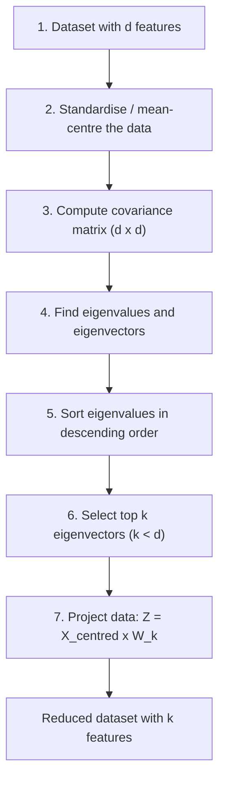
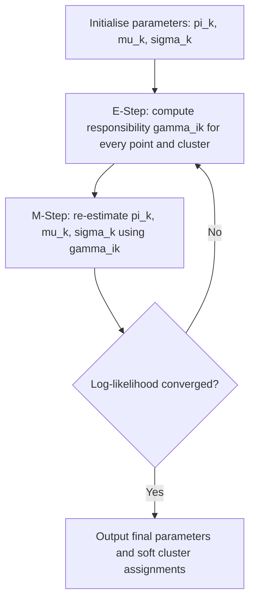

# Machine Learning (CSL701) — MU Sem 7 Unit Test 2 (PT-2)
*Mumbai University | BE Computer Engineering | Thadomal Shahani Engineering College*

> [!NOTE]
> **Reviewed and corrected version.** Every numerical below has been re-solved and machine-verified.
> **Q3 has been CORRECTED** — the earlier answer (x + y = 5.5) separated the classes but was NOT the maximum-margin hyperplane.

---

## Part A: Question Bank Analysis & Strategy

### Exam Pattern
* **Total:** 20 marks | **Duration:** 1 hour
* **Nature of this PT:** Very **numerical-heavy** — carry a scientific calculator (fx-991ES/EX: use `MATRIX` and `EQN` modes).
* **Modules covered:** SVM (Dimensionality reduction: LDA, PCA, SVD) and Unsupervised learning (DBSCAN, EM/GMM).

### Priority Matrix

| Priority | Questions | Topic | Type |
| :--- | :--- | :--- | :--- |
| 🔴 **HIGHEST** | Q3, Q4 | SVM hyperplane numericals | Numerical (α-equation method) |
| 🔴 **HIGHEST** | Q5, Q10 | LDA, PCA numericals | Numerical (matrix work) |
| 🟠 **HIGH** | Q6, Q8, Q9 | SVD, DBSCAN, EM numericals | Numerical |
| 🟡 **MEDIUM** | Q7, Q12 | PCA steps, EM algorithm | Theory + flowchart |
| 🟢 **STANDARD** | Q1, Q2, Q11 | SVM terms, Kernels, DBSCAN note | Theory + diagram |

> [!TIP]
> **Pattern seen in this QB:** Each "theory" question pairs with a numerical on the same topic (Q1/Q2 ↔ Q3/Q4, Q7 ↔ Q10, Q11 ↔ Q8, Q12 ↔ Q9). If you master the 7 numericals, the theory answers come almost free — reuse the same formulas and diagrams.

---

## Part B: Complete Answers

### Q1) Explain with illustrations: (i) Optimal Decision Boundary (ii) Support Vectors (iii) Margin

**Support Vector Machine (SVM)** is a supervised learning algorithm that classifies data by finding the hyperplane that separates the classes with the **maximum margin**.

**Diagram (draw this in the exam):**

```text
   x2
    |        +            Positive class (+)
    |    +        +
    |  [+]  .  .  .  .  .  .  .  .   <- Positive margin:  w.x + b = +1
    |        \
    |   ------\--------------------- <- OPTIMAL HYPERPLANE: w.x + b = 0
    |          \
    |  .  .  .  [o]  .  .  .  .  .   <- Negative margin:  w.x + b = -1
    |       o        o
    |   o        o                Negative class (o)
    +------------------------------------ x1

   [+] and [o]  = SUPPORT VECTORS (points lying ON the margin lines)
   Gap between the two dotted lines = MARGIN = 2 / ||w||
```

**(i) Optimal Decision Boundary (Optimal Hyperplane)**
* The line (2D) / plane (3D) / hyperplane (nD) that separates the two classes: $w \cdot x + b = 0$
* Many hyperplanes can separate the data; the **optimal** one is the one with the **largest margin** from the nearest points of both classes.
* Larger margin ⇒ better generalisation to unseen data.

**(ii) Support Vectors**
* The training points that lie **closest** to the decision boundary — exactly on the margin lines $w \cdot x + b = \pm 1$.
* They alone determine the position and orientation of the hyperplane. Removing any other point does **not** change the boundary; removing a support vector **does**.
* Hence the name: they "support" the hyperplane.

**(iii) Margin**
* The perpendicular distance between the two margin lines (passing through the support vectors of each class).
* Formula: $\text{Margin} = \dfrac{2}{\lVert w \rVert}$
* SVM **maximises** the margin, which is equivalent to **minimising** $\frac{1}{2}\lVert w \rVert^2$ subject to $y_i (w \cdot x_i + b) \ge 1$.
* **Hard margin:** no misclassification allowed (perfectly separable data). **Soft margin:** allows some violations using slack variables and penalty C (for noisy data).

---

### Q2) What are kernel functions? List some kernel functions. What is their use in SVM?

**Definition:**
A kernel function $K(x, y)$ computes the dot product of two points **in a higher-dimensional feature space** without actually transforming the points into that space:

$$K(x, y) = \phi(x) \cdot \phi(y)$$

where $\phi$ is the mapping to the higher-dimensional space.

**Use in SVM — the Kernel Trick:**
1. Real data is often **not linearly separable** in the original space (e.g., one class surrounded by another in a ring).
2. Mapping data to a higher dimension using $\phi$ can make it **linearly separable**.
3. Computing $\phi(x)$ explicitly may be very expensive (or infinite-dimensional, as with RBF).
4. The SVM optimisation only needs **dot products** between points — so we replace every $x_i \cdot x_j$ with $K(x_i, x_j)$.
5. Result: a non-linear decision boundary in the original space at the cost of a linear SVM.

**Illustration (draw this):**

```text
  Original 1D space (NOT linearly separable)      After mapping phi(x) = (x, x^2)  -> separable
                                                     x^2
    o   o   +   +   +   o   o                         |  o               o
   -3  -2  -1   0   1   2   3                         |     o         o
                                                      | - - - - - - - - - -   <- linear boundary
   No single point can split + from o                 |      +   +   +
                                                      +--------------------- x
```

**Worked example (polynomial kernel) — good for extra marks:**
For $x = (x_1, x_2)$ take $\phi(x) = (x_1^2,\ \sqrt{2}x_1x_2,\ x_2^2)$. Then

$$\phi(x)\cdot\phi(y) = x_1^2y_1^2 + 2x_1x_2y_1y_2 + x_2^2y_2^2 = (x \cdot y)^2 = K(x,y)$$

So the 3D dot product is obtained from a 2D dot product squared — no explicit mapping needed.

**Common Kernel Functions:**

| Kernel | Formula | When to use |
| :--- | :--- | :--- |
| Linear | $K(x,y) = x \cdot y$ | Data already linearly separable; text classification |
| Polynomial | $K(x,y) = (x \cdot y + c)^d$ | Curved boundaries; image processing |
| RBF / Gaussian | $K(x,y) = \exp(-\gamma \lVert x - y \rVert^2)$ | Most popular default; complex non-linear data |
| Sigmoid | $K(x,y) = \tanh(\alpha\, x \cdot y + c)$ | Behaves like a neural-network activation |

---

### Q3) Obtain the optimal binary hyperplane for: +ve class {(1,1), (3,1), (1,4)}, −ve class {(2,4), (3,3), (5,1)}

> [!WARNING]
> **Correction:** The earlier answer $x + y = 5.5$ is a valid *separating* line but **not optimal**: its margin is 0.707, whereas the true optimal hyperplane below has margin **0.832**. Examiners check this.

**Step 1: Plot the points and identify Support Vectors**

```text
  y
  5 |
  4 |  +(1,4)  o(2,4)
  3 |                 o(3,3)
  2 |
  1 |  +(1,1)         +(3,1)          o(5,1)
    +----------------------------------------- x
       1       2       3       4       5
```

* The +ve points nearest the −ve class: **(1,4)** and **(3,1)**.
* The −ve point nearest the +ve class: **(2,4)** (its distance to the segment joining (1,4)–(3,1) is the smallest gap between classes).
* **Support vectors:** $s_1 = (3,1)$ [+], $s_2 = (1,4)$ [+], $s_3 = (2,4)$ [−]

**Step 2: Augment each support vector with bias input 1**

$\tilde{s}_1 = (3, 1, 1)$, $\tilde{s}_2 = (1, 4, 1)$, $\tilde{s}_3 = (2, 4, 1)$

**Step 3: Compute dot products**

| | $\tilde{s}_1$ | $\tilde{s}_2$ | $\tilde{s}_3$ |
| :--- | :---: | :---: | :---: |
| $\tilde{s}_1$ | 9+1+1 = **11** | 3+4+1 = **8** | 6+4+1 = **11** |
| $\tilde{s}_2$ | 8 | 1+16+1 = **18** | 2+16+1 = **19** |
| $\tilde{s}_3$ | 11 | 19 | 4+16+1 = **21** |

**Step 4: Form the equations** ($\sum_j \alpha_j\, \tilde{s}_j \cdot \tilde{s}_i = y_i$)

* $11\alpha_1 + 8\alpha_2 + 11\alpha_3 = +1$
* $8\alpha_1 + 18\alpha_2 + 19\alpha_3 = +1$
* $11\alpha_1 + 19\alpha_2 + 21\alpha_3 = -1$

Solving (calculator `EQN` mode, 3 unknowns):

$\alpha_1 = \dfrac{104}{9} = 11.556,\quad \alpha_2 = \dfrac{272}{9} = 30.222,\quad \alpha_3 = -\dfrac{301}{9} = -33.444$

**Step 5: Compute the augmented weight vector** $\tilde{w} = \sum \alpha_i \tilde{s}_i$

* $w_1 = \frac{1}{9}(104 \times 3 + 272 \times 1 - 301 \times 2) = \frac{1}{9}(312 + 272 - 602) = \frac{-18}{9} = -2$
* $w_2 = \frac{1}{9}(104 \times 1 + 272 \times 4 - 301 \times 4) = \frac{1}{9}(104 + 1088 - 1204) = \frac{-12}{9} = -\frac{4}{3}$
* $b = \frac{1}{9}(104 + 272 - 301) = \frac{75}{9} = \frac{25}{3}$

$\tilde{w} = (-2,\ -4/3,\ 25/3)$

**Step 6: Hyperplane equation**

$-2x - \frac{4}{3}y + \frac{25}{3} = 0$ → multiply by −3 →

$$\boxed{6x + 4y - 25 = 0} \quad \text{(equivalently } 3x + 2y = 12.5\text{)}$$

**Step 7: Verification** — $f(x) = -2x - \frac{4}{3}y + \frac{25}{3}$

| Point | Class | $f(x)$ | Check |
| :--- | :---: | :---: | :--- |
| (1,1) | + | 5.00 | ≥ +1 ✓ |
| (3,1) | + | **+1.00** | on +ve margin (SV) ✓ |
| (1,4) | + | **+1.00** | on +ve margin (SV) ✓ |
| (2,4) | − | **−1.00** | on −ve margin (SV) ✓ |
| (3,3) | − | −1.67 | ≤ −1 ✓ |
| (5,1) | − | −3.00 | ≤ −1 ✓ |

**Margin** $= \dfrac{2}{\lVert w \rVert} = \dfrac{2}{\sqrt{4 + 16/9}} = \dfrac{6}{\sqrt{52}} = \mathbf{0.832}$

> [!TIP]
> **Geometric shortcut (to cross-check in 30 seconds):** The line through the +ve SVs (3,1) and (1,4) has slope −3/2, i.e. $3x + 2y = 11$. The parallel line through the −ve SV (2,4) is $3x + 2y = 14$. The optimal hyperplane lies midway: $3x + 2y = 12.5$ ✓.
>
> **Why not x + y = 5.5?** If you pick (1,4), (2,4), (3,3) as SVs you get $x + y = 5.5$ with margin $1/\sqrt{2} = 0.707$ — it separates, but $0.707 < 0.832$, so it is **not** the maximum margin.

---

### Q4) +ve points {(3,1), (3,−1), (6,1), (6,−1)}, −ve points {(1,0), (0,1), (0,−1), (−1,0)}. Find the SVM decision boundary and classify (1,3).

**Step 1: Plot and identify Support Vectors**

```text
   y
   1 |      o            +(3,1)          +(6,1)
   0 | o         o(1,0)
  -1 |      o            +(3,-1)         +(6,-1)
     +---------------------------------------------- x
      -1    0     1   2   3                 6
                      ^
                 boundary x = 2
```

* −ve point closest to the +ve class: **(1,0)**
* +ve points closest to the −ve class: **(3,1)** and **(3,−1)**
* **Support vectors:** $s_1 = (1,0)$ [−], $s_2 = (3,1)$ [+], $s_3 = (3,-1)$ [+]

**Step 2: Augment with bias 1**

$\tilde{s}_1 = (1, 0, 1)$, $\tilde{s}_2 = (3, 1, 1)$, $\tilde{s}_3 = (3, -1, 1)$

**Step 3: Dot products**

| | $\tilde{s}_1$ | $\tilde{s}_2$ | $\tilde{s}_3$ |
| :--- | :---: | :---: | :---: |
| $\tilde{s}_1$ | **2** | **4** | **4** |
| $\tilde{s}_2$ | 4 | **11** | **9** |
| $\tilde{s}_3$ | 4 | 9 | **11** |

**Step 4: Equations**

* $2\alpha_1 + 4\alpha_2 + 4\alpha_3 = -1$
* $4\alpha_1 + 11\alpha_2 + 9\alpha_3 = +1$
* $4\alpha_1 + 9\alpha_2 + 11\alpha_3 = +1$

From eq.2 − eq.3: $2\alpha_2 - 2\alpha_3 = 0 \Rightarrow \alpha_2 = \alpha_3$.
Substituting: $2\alpha_1 + 8\alpha_2 = -1$ and $4\alpha_1 + 20\alpha_2 = 1$ → $\alpha_2 = 0.75$, $\alpha_1 = -3.5$

$$\alpha_1 = -3.5,\quad \alpha_2 = 0.75,\quad \alpha_3 = 0.75$$

**Step 5: Weight vector**

$\tilde{w} = -3.5(1,0,1) + 0.75(3,1,1) + 0.75(3,-1,1)$

* $w_1 = -3.5 + 2.25 + 2.25 = 1$
* $w_2 = 0 + 0.75 - 0.75 = 0$
* $b = -3.5 + 0.75 + 0.75 = -2$

$$\tilde{w} = (1,\ 0,\ -2) \quad\Rightarrow\quad w = (1, 0),\ b = -2$$

**Step 6: Decision boundary**

$$\boxed{x - 2 = 0 \quad \text{i.e. } x = 2}$$

Margin $= 2 / \lVert w \rVert = 2/1 = 2$ (distance between $x = 1$ and $x = 3$ ✓)

**Step 7: Classify (1,3)**

$f(1,3) = 1(1) + 0(3) - 2 = -1 < 0$

**(1,3) belongs to the NEGATIVE class.** (It lies exactly on the −ve margin line $x = 1$.)

---

### Q5) Compute the Linear Discriminant (LDA) projection for X1 = {(4,1), (2,4), (2,3), (3,6), (4,4)} and X2 = {(9,10), (6,8), (9,5), (8,7), (10,8)}

**Goal of LDA:** find direction $w$ that **maximises** between-class separation and **minimises** within-class scatter (Fisher criterion $J(w) = \frac{w^T S_B w}{w^T S_W w}$). Solution: $w \propto S_W^{-1}(\mu_1 - \mu_2)$.

**Step 1: Class means**

* $\mu_1 = \left(\frac{4+2+2+3+4}{5}, \frac{1+4+3+6+4}{5}\right) = (3.0,\ 3.6)$
* $\mu_2 = \left(\frac{9+6+9+8+10}{5}, \frac{10+8+5+7+8}{5}\right) = (8.4,\ 7.6)$

**Step 2: Scatter matrix of class 1** — $S_1 = \sum (x - \mu_1)(x - \mu_1)^T$

| x | $x - \mu_1$ | $(dx)^2$ | $(dy)^2$ | $dx \cdot dy$ |
| :--- | :--- | :---: | :---: | :---: |
| (4,1) | (1, −2.6) | 1 | 6.76 | −2.6 |
| (2,4) | (−1, 0.4) | 1 | 0.16 | −0.4 |
| (2,3) | (−1, −0.6) | 1 | 0.36 | 0.6 |
| (3,6) | (0, 2.4) | 0 | 5.76 | 0 |
| (4,4) | (1, 0.4) | 1 | 0.16 | 0.4 |
| **Sum** | | **4.0** | **13.2** | **−2.0** |

$$S_1 = \begin{bmatrix} 4.0 & -2.0 \cr -2.0 & 13.2 \end{bmatrix}$$

**Step 3: Scatter matrix of class 2**

| x | $x - \mu_2$ | $(dx)^2$ | $(dy)^2$ | $dx \cdot dy$ |
| :--- | :--- | :---: | :---: | :---: |
| (9,10) | (0.6, 2.4) | 0.36 | 5.76 | 1.44 |
| (6,8) | (−2.4, 0.4) | 5.76 | 0.16 | −0.96 |
| (9,5) | (0.6, −2.6) | 0.36 | 6.76 | −1.56 |
| (8,7) | (−0.4, −0.6) | 0.16 | 0.36 | 0.24 |
| (10,8) | (1.6, 0.4) | 2.56 | 0.16 | 0.64 |
| **Sum** | | **9.2** | **13.2** | **−0.2** |

$$S_2 = \begin{bmatrix} 9.2 & -0.2 \cr -0.2 & 13.2 \end{bmatrix}$$

**Step 4: Within-class scatter and its inverse**

$$S_W = S_1 + S_2 = \begin{bmatrix} 13.2 & -2.2 \cr -2.2 & 26.4 \end{bmatrix}$$

$|S_W| = (13.2)(26.4) - (-2.2)(-2.2) = 348.48 - 4.84 = 343.64$

$$S_W^{-1} = \frac{1}{343.64}\begin{bmatrix} 26.4 & 2.2 \cr 2.2 & 13.2 \end{bmatrix}$$

**Step 5: Projection vector**

$\mu_1 - \mu_2 = (3.0 - 8.4,\ 3.6 - 7.6) = (-5.4,\ -4.0)$

* $w_1 = \frac{1}{343.64}\left[(26.4)(-5.4) + (2.2)(-4.0)\right] = \frac{-142.56 - 8.8}{343.64} = \frac{-151.36}{343.64} = -0.4405$
* $w_2 = \frac{1}{343.64}\left[(2.2)(-5.4) + (13.2)(-4.0)\right] = \frac{-11.88 - 52.8}{343.64} = \frac{-64.68}{343.64} = -0.1882$

$$w = \begin{bmatrix} -0.4405 \cr -0.1882 \end{bmatrix}$$

**Step 6: Normalise** (direction only matters; sign can be flipped)

$\lVert w \rVert = \sqrt{0.4405^2 + 0.1882^2} = 0.4790$

$$\boxed{w = \begin{bmatrix} 0.920 \cr 0.393 \end{bmatrix}}$$

**Step 7: Project the data** — $y = w^T x = 0.920\,x_1 + 0.393\,x_2$

| Class 1 point | Projection | Class 2 point | Projection |
| :--- | :---: | :--- | :---: |
| (4,1) | 4.071 | (9,10) | 12.206 |
| (2,4) | 3.411 | (6,8) | 8.661 |
| (2,3) | 3.018 | (9,5) | 10.241 |
| (3,6) | 5.116 | (8,7) | 10.107 |
| (4,4) | 5.250 | (10,8) | 12.339 |

Projected means: 4.173 (class 1) and 10.711 (class 2). Threshold = midpoint = **7.442**.
All class-1 projections < 7.442 < all class-2 projections → the classes are **perfectly separated in 1D**.

> [!NOTE]
> Some textbooks compute $S_i$ as a covariance (divide by $N-1 = 4$). Then $S_W = \begin{bmatrix} 3.3 & -0.55 \cr -0.55 & 6.6 \end{bmatrix}$ and $w$ is 4× larger — but the **normalised direction (0.920, 0.393) is identical**. Either method gets full marks.

---

### Q6) Find the SVD of A = [[2, 2], [−1, 1]]

$$A = \begin{bmatrix} 2 & 2 \cr -1 & 1 \end{bmatrix}, \qquad A = U \Sigma V^T$$

**Step 1: Compute** $A^T A$

$$A^T A = \begin{bmatrix} 2 & -1 \cr 2 & 1 \end{bmatrix}\begin{bmatrix} 2 & 2 \cr -1 & 1 \end{bmatrix} = \begin{bmatrix} 5 & 3 \cr 3 & 5 \end{bmatrix}$$

**Step 2: Eigenvalues of** $A^T A$

$\det(A^TA - \lambda I) = (5-\lambda)^2 - 9 = 0 \Rightarrow \lambda^2 - 10\lambda + 16 = 0 \Rightarrow (\lambda - 8)(\lambda - 2) = 0$

$\lambda_1 = 8,\ \lambda_2 = 2$ → singular values $\sigma_1 = \sqrt{8} = 2\sqrt{2} = 2.828$, $\sigma_2 = \sqrt{2} = 1.414$

$$\Sigma = \begin{bmatrix} 2\sqrt{2} & 0 \cr 0 & \sqrt{2} \end{bmatrix}$$

**Step 3: Eigenvectors of** $A^TA$ → columns of $V$

* $\lambda_1 = 8$: $-3x_1 + 3x_2 = 0 \Rightarrow x_1 = x_2$ → $v_1 = \frac{1}{\sqrt{2}}(1, 1)$
* $\lambda_2 = 2$: $3x_1 + 3x_2 = 0 \Rightarrow x_1 = -x_2$ → $v_2 = \frac{1}{\sqrt{2}}(-1, 1)$

$$V = \frac{1}{\sqrt{2}}\begin{bmatrix} 1 & -1 \cr 1 & 1 \end{bmatrix}, \qquad V^T = \frac{1}{\sqrt{2}}\begin{bmatrix} 1 & 1 \cr -1 & 1 \end{bmatrix}$$

**Step 4: Columns of** $U$ using $u_i = \frac{1}{\sigma_i} A v_i$

* $A v_1 = \frac{1}{\sqrt{2}}(2+2,\ -1+1) = \frac{1}{\sqrt{2}}(4, 0)$ → $u_1 = \frac{1}{2\sqrt{2}} \cdot \frac{1}{\sqrt{2}}(4, 0) = (1, 0)$
* $A v_2 = \frac{1}{\sqrt{2}}(-2+2,\ 1+1) = \frac{1}{\sqrt{2}}(0, 2)$ → $u_2 = \frac{1}{\sqrt{2}} \cdot \frac{1}{\sqrt{2}}(0, 2) = (0, 1)$

$$U = \begin{bmatrix} 1 & 0 \cr 0 & 1 \end{bmatrix}$$

*Cross-check:* $AA^T = \begin{bmatrix} 8 & 0 \cr 0 & 2 \end{bmatrix}$ is already diagonal, so its eigenvectors are (1,0) and (0,1) → $U = I$ ✓

**Final Answer:**

$$A = \underbrace{\begin{bmatrix} 1 & 0 \cr 0 & 1 \end{bmatrix}}_{U}\ \underbrace{\begin{bmatrix} 2\sqrt{2} & 0 \cr 0 & \sqrt{2} \end{bmatrix}}_{\Sigma}\ \underbrace{\frac{1}{\sqrt{2}}\begin{bmatrix} 1 & 1 \cr -1 & 1 \end{bmatrix}}_{V^T}$$

**Step 5: Verification** — $\Sigma V^T = \begin{bmatrix} 2 & 2 \cr -1 & 1 \end{bmatrix} = A$ ✓ (since $2\sqrt{2}/\sqrt{2} = 2$ and $\sqrt{2}/\sqrt{2} = 1$)

---

### Q7) Give steps to design PCA dimensionality reduction with an example

**Principal Component Analysis (PCA)** is an unsupervised technique that transforms correlated features into a smaller set of **uncorrelated** features (principal components) that capture the **maximum variance**.



**Steps:**
1. **Standardise the data:** subtract the mean of each feature (and divide by std. deviation if features have different scales).
2. **Covariance matrix:** $\text{Cov}(X,Y) = \dfrac{\sum (x_i - \bar{x})(y_i - \bar{y})}{n - 1}$ for every pair of features.
3. **Eigen-decomposition:** solve $\det(C - \lambda I) = 0$ for eigenvalues; then $(C - \lambda I)v = 0$ for eigenvectors.
4. **Sort** eigenvalues $\lambda_1 \ge \lambda_2 \ge \dots$ — each eigenvalue = variance captured by its eigenvector.
5. **Choose k components** such that the explained variance $\dfrac{\sum_{i=1}^{k}\lambda_i}{\sum \lambda_i}$ is high (typically ≥ 90–95%).
6. **Project:** multiply the centred data by the matrix of the top-k eigenvectors.

**Example:** For the 2D data in Q10, $\lambda_1 = 9.849$ and $\lambda_2 = 0.451$. PC1 alone explains $9.849 / 10.3 = 95.6\%$ of the variance, so the 2D data can be reduced to **1D** with only 4.4% information loss.

**Applications:** image compression, face recognition (Eigenfaces), noise removal, visualisation of high-dimensional data.

---

### Q8) Apply DBSCAN: P1(1,1), P2(1,2), P3(2,1), P4(2,2), P5(8,8), P6(8,9), P7(9,8), P8(25,25); ε = 1.5, MinPts = 3

**Definitions:**
* **Core point:** has at least MinPts (= 3) points within distance ε, **including itself**.
* **Border point:** fewer than MinPts neighbours, but lies within ε of a core point.
* **Noise point:** neither core nor border.

**Step 1: Distance matrix** (Euclidean; ✓ = within ε = 1.5)

| | P1 | P2 | P3 | P4 | P5 | P6 | P7 | P8 |
| :--- | :---: | :---: | :---: | :---: | :---: | :---: | :---: | :---: |
| **P1** | 0 ✓ | 1.00 ✓ | 1.00 ✓ | 1.41 ✓ | 9.90 | 10.63 | 10.63 | 33.94 |
| **P2** | 1.00 ✓ | 0 ✓ | 1.41 ✓ | 1.00 ✓ | 9.22 | 9.90 | 10.00 | 33.24 |
| **P3** | 1.00 ✓ | 1.41 ✓ | 0 ✓ | 1.00 ✓ | 9.22 | 10.00 | 9.90 | 33.24 |
| **P4** | 1.41 ✓ | 1.00 ✓ | 1.00 ✓ | 0 ✓ | 8.49 | 9.22 | 9.22 | 32.53 |
| **P5** | 9.90 | 9.22 | 9.22 | 8.49 | 0 ✓ | 1.00 ✓ | 1.00 ✓ | 24.04 |
| **P6** | 10.63 | 9.90 | 10.00 | 9.22 | 1.00 ✓ | 0 ✓ | 1.41 ✓ | 23.35 |
| **P7** | 10.63 | 10.00 | 9.90 | 9.22 | 1.00 ✓ | 1.41 ✓ | 0 ✓ | 23.35 |
| **P8** | 33.94 | 33.24 | 33.24 | 32.53 | 24.04 | 23.35 | 23.35 | 0 ✓ |

**Step 2: ε-neighbourhood and classification**

| Point | ε-neighbourhood | Count | ≥ MinPts? | Type |
| :--- | :--- | :---: | :---: | :--- |
| P1 | {P1, P2, P3, P4} | 4 | Yes | **Core** |
| P2 | {P1, P2, P3, P4} | 4 | Yes | **Core** |
| P3 | {P1, P2, P3, P4} | 4 | Yes | **Core** |
| P4 | {P1, P2, P3, P4} | 4 | Yes | **Core** |
| P5 | {P5, P6, P7} | 3 | Yes | **Core** |
| P6 | {P5, P6, P7} | 3 | Yes | **Core** |
| P7 | {P5, P6, P7} | 3 | Yes | **Core** |
| P8 | {P8} | 1 | No | **Noise** (not near any core point) |

**Step 3: Cluster formation**
* Start at P1 (core) → add its density-reachable points P2, P3, P4 → all are core but add nothing new → **Cluster C1 = {P1, P2, P3, P4}**
* Next unvisited core P5 → add P6, P7 → **Cluster C2 = {P5, P6, P7}**
* P8 is not density-reachable from any core point → **Noise / Outlier**

**Final Answer:**

| Result | Points |
| :--- | :--- |
| Core points | P1, P2, P3, P4, P5, P6, P7 |
| Border points | None |
| Noise | P8 |
| Clusters | **C1 = {P1, P2, P3, P4}**, **C2 = {P5, P6, P7}** |

---

### Q9) EM algorithm: X = {0.2, 0.3, 0.5, 0.6, 0.7, 0.8}, two Gaussians, initial π₁ = π₂ = 0.5, μ₁ = 0.3, μ₂ = 0.7, σ₁² = σ₂² = 0.01. Perform one complete iteration.

**Gaussian PDF:**

$$N(x \mid \mu, \sigma^2) = \frac{1}{\sqrt{2\pi\sigma^2}}\exp\left(-\frac{(x - \mu)^2}{2\sigma^2}\right)$$

With $\sigma^2 = 0.01$: $\frac{1}{\sqrt{2\pi(0.01)}} = 3.989$ and $2\sigma^2 = 0.02$, so

$$N(x) = 3.989\, \exp\left(-\frac{(x-\mu)^2}{0.02}\right)$$

#### E-Step: compute responsibilities

$$\gamma_{i1} = \frac{\pi_1 N(x_i \mid \mu_1, \sigma_1^2)}{\pi_1 N(x_i \mid \mu_1, \sigma_1^2) + \pi_2 N(x_i \mid \mu_2, \sigma_2^2)}, \qquad \gamma_{i2} = 1 - \gamma_{i1}$$

(Since $\pi_1 = \pi_2 = 0.5$, the π terms cancel.)

| $x_i$ | $(x-0.3)^2$ | $N_1 = N(x \mid 0.3)$ | $(x-0.7)^2$ | $N_2 = N(x \mid 0.7)$ | $\gamma_{i1}$ | $\gamma_{i2}$ |
| :---: | :---: | :---: | :---: | :---: | :---: | :---: |
| 0.2 | 0.01 | 2.4197 | 0.25 | 0.000015 | **1.0000** | 0.0000 |
| 0.3 | 0.00 | 3.9894 | 0.16 | 0.001338 | **0.9997** | 0.0003 |
| 0.5 | 0.04 | 0.5399 | 0.04 | 0.5399 | **0.5000** | **0.5000** |
| 0.6 | 0.09 | 0.0443 | 0.01 | 2.4197 | 0.0180 | **0.9820** |
| 0.7 | 0.16 | 0.001338 | 0.00 | 3.9894 | 0.0003 | **0.9997** |
| 0.8 | 0.25 | 0.000015 | 0.01 | 2.4197 | 0.0000 | **1.0000** |

Effective counts: $N_1 = \sum \gamma_{i1} = 2.518$, $N_2 = \sum \gamma_{i2} = 3.482$ (check: $N_1 + N_2 = 6$ ✓)

#### M-Step: update parameters

**(a) Means** $\mu_k = \dfrac{\sum \gamma_{ik} x_i}{N_k}$

* $\sum \gamma_{i1} x_i = (1)(0.2) + (0.9997)(0.3) + (0.5)(0.5) + (0.018)(0.6) + (0.0003)(0.7) = 0.7609$
* $\mu_1 = 0.7609 / 2.518 = \mathbf{0.3022}$
* $\sum \gamma_{i2} x_i = (0.0003)(0.3) + (0.5)(0.5) + (0.982)(0.6) + (0.9997)(0.7) + (1)(0.8) = 2.3391$
* $\mu_2 = 2.3391 / 3.482 = \mathbf{0.6718}$

**(b) Variances** $\sigma_k^2 = \dfrac{\sum \gamma_{ik}(x_i - \mu_k)^2}{N_k}$

| $x_i$ | $\gamma_{i1}(x_i - 0.3022)^2$ | $\gamma_{i2}(x_i - 0.6718)^2$ |
| :---: | :---: | :---: |
| 0.2 | 0.01044 | 0.00000 |
| 0.3 | 0.00000 | 0.00005 |
| 0.5 | 0.01956 | 0.01475 |
| 0.6 | 0.00160 | 0.00506 |
| 0.7 | 0.00005 | 0.00080 |
| 0.8 | 0.00000 | 0.01645 |
| **Sum** | **0.03166** | **0.03710** |

* $\sigma_1^2 = 0.03166 / 2.518 = \mathbf{0.0126}$
* $\sigma_2^2 = 0.03710 / 3.482 = \mathbf{0.0107}$

**(c) Mixing weights** $\pi_k = N_k / n$

* $\pi_1 = 2.518 / 6 = \mathbf{0.420}$
* $\pi_2 = 3.482 / 6 = \mathbf{0.580}$

**Updated parameters after iteration 1:**

| Parameter | Initial | After 1 iteration |
| :--- | :---: | :---: |
| $\mu_1$ | 0.3 | **0.3022** |
| $\mu_2$ | 0.7 | **0.6718** |
| $\sigma_1^2$ | 0.01 | **0.0126** |
| $\sigma_2^2$ | 0.01 | **0.0107** |
| $\pi_1$ | 0.5 | **0.420** |
| $\pi_2$ | 0.5 | **0.580** |

**Interpretation:** Cluster 2 gained weight (0.58) because points 0.6, 0.7, 0.8 and half of 0.5 belong to it; μ₂ shifted left towards 0.6.

---

### Q10) Apply PCA to {(2,1), (3,5), (4,3), (5,6), (6,7), (7,8)}: find mean, covariance matrix, eigenvalues, eigenvectors and principal component

**Step 1: Mean**

$\bar{x} = \frac{2+3+4+5+6+7}{6} = \frac{27}{6} = 4.5, \qquad \bar{y} = \frac{1+5+3+6+7+8}{6} = \frac{30}{6} = 5.0$

**Step 2: Centred data and products**

| x | y | $x - \bar{x}$ | $y - \bar{y}$ | $(x-\bar{x})^2$ | $(y-\bar{y})^2$ | $(x-\bar{x})(y-\bar{y})$ |
| :---: | :---: | :---: | :---: | :---: | :---: | :---: |
| 2 | 1 | −2.5 | −4 | 6.25 | 16 | 10.0 |
| 3 | 5 | −1.5 | 0 | 2.25 | 0 | 0.0 |
| 4 | 3 | −0.5 | −2 | 0.25 | 4 | 1.0 |
| 5 | 6 | 0.5 | 1 | 0.25 | 1 | 0.5 |
| 6 | 7 | 1.5 | 2 | 2.25 | 4 | 3.0 |
| 7 | 8 | 2.5 | 3 | 6.25 | 9 | 7.5 |
| | | | **Sum** | **17.5** | **34** | **22.0** |

**Step 3: Covariance matrix** (divide by $n - 1 = 5$)

$\text{Var}(x) = 17.5/5 = 3.5, \quad \text{Var}(y) = 34/5 = 6.8, \quad \text{Cov}(x,y) = 22/5 = 4.4$

$$C = \begin{bmatrix} 3.5 & 4.4 \cr 4.4 & 6.8 \end{bmatrix}$$

**Step 4: Eigenvalues** — $\det(C - \lambda I) = 0$

$(3.5 - \lambda)(6.8 - \lambda) - 4.4^2 = 0$
$\lambda^2 - 10.3\lambda + (23.8 - 19.36) = 0$
$\lambda^2 - 10.3\lambda + 4.44 = 0$

$\lambda = \dfrac{10.3 \pm \sqrt{10.3^2 - 4(4.44)}}{2} = \dfrac{10.3 \pm \sqrt{88.33}}{2} = \dfrac{10.3 \pm 9.398}{2}$

$$\lambda_1 = 9.849, \qquad \lambda_2 = 0.451$$

*Check:* $\lambda_1 + \lambda_2 = 10.3 = 3.5 + 6.8$ (trace) ✓; $\lambda_1 \lambda_2 = 4.44 = \det C$ ✓

**Step 5: Eigenvectors**

* For $\lambda_1 = 9.849$: $(3.5 - 9.849)a + 4.4b = 0 \Rightarrow -6.349a + 4.4b = 0 \Rightarrow (a, b) = (4.4,\ 6.349)$
  Length $= \sqrt{4.4^2 + 6.349^2} = 7.725$ → $e_1 = (0.570,\ 0.822)$
* For $\lambda_2 = 0.451$: $e_2 = (0.822,\ -0.570)$ (perpendicular to $e_1$)

**Step 6: Principal Component**

$$\boxed{PC_1 = e_1 = \begin{bmatrix} 0.570 \cr 0.822 \end{bmatrix}}$$

Variance explained by PC1 $= \dfrac{9.849}{10.3} = \mathbf{95.6\%}$ → PC1 alone is sufficient.

**Step 7: Project data onto PC1** — $z = 0.570(x - 4.5) + 0.822(y - 5)$

| Point | (2,1) | (3,5) | (4,3) | (5,6) | (6,7) | (7,8) |
| :--- | :---: | :---: | :---: | :---: | :---: | :---: |
| **z (1D)** | −4.712 | −0.854 | −1.929 | 1.107 | 2.498 | 3.890 |

The 2D dataset is now reduced to these **1D values**.

> [!NOTE]
> If your teacher divides by $n = 6$ instead of $n - 1$: $C = \begin{bmatrix} 2.917 & 3.667 \cr 3.667 & 5.667 \end{bmatrix}$, eigenvalues become 8.208 and 0.376, but the **eigenvectors (and PC1) are identical**. State which convention you use.

---

### Q11) Write a short note on DBSCAN

**DBSCAN (Density-Based Spatial Clustering of Applications with Noise)** is an unsupervised clustering algorithm that groups points lying in **dense regions** and labels points in sparse regions as **noise**.

**Parameters:**
1. **ε (Eps):** radius of the neighbourhood around a point.
2. **MinPts:** minimum number of points (including the point itself) needed in the ε-neighbourhood to form a dense region.

**Point types (draw this):**

```text
          . . . . .                       
        .   C   C   .        C = Core   (>= MinPts points within eps)
       .  C   C   C  B       B = Border (< MinPts, but within eps of a Core)
        .   C   C   .        N = Noise  (neither)
          . . . . .
                                   N
```

**Key concepts:**
* **Directly density-reachable:** q is within ε of a core point p.
* **Density-reachable:** a chain of directly density-reachable core points connects p to q.
* **Density-connected:** p and q are both density-reachable from some core point o.

**Algorithm:**
1. Mark all points unvisited.
2. Pick an unvisited point p; find its ε-neighbourhood.
3. If neighbours < MinPts → mark p as noise (it may later become a border point).
4. Else → start a new cluster; add all density-reachable points recursively.
5. Repeat until all points are visited.

**DBSCAN vs K-Means:**

| Feature | DBSCAN | K-Means |
| :--- | :--- | :--- |
| Number of clusters | Found automatically | Must specify K |
| Cluster shape | Arbitrary (rings, spirals) | Spherical only |
| Outliers | Detected as noise | Forced into a cluster |
| Parameters | ε, MinPts | K |

**Advantages:** no need for K, finds arbitrary shapes, robust to outliers.
**Disadvantages:** sensitive to ε and MinPts; struggles when clusters have **different densities**; distance becomes less meaningful in high dimensions.

---

### Q12) Explain the EM algorithm

**Expectation–Maximisation (EM)** is an iterative algorithm to find **maximum likelihood estimates** of parameters in models with **latent (hidden) variables** — e.g., which Gaussian generated each point in a Gaussian Mixture Model (GMM).



**Steps (for GMM with K components):**

1. **Initialisation:** choose initial $\pi_k, \mu_k, \sigma_k^2$ (randomly or from K-Means).

2. **E-Step (Expectation):** compute the probability that point $x_i$ belongs to cluster $k$:

$$\gamma_{ik} = \frac{\pi_k\, N(x_i \mid \mu_k, \sigma_k^2)}{\sum_{j=1}^{K} \pi_j\, N(x_i \mid \mu_j, \sigma_j^2)}$$

3. **M-Step (Maximisation):** update parameters using $N_k = \sum_i \gamma_{ik}$:

$$\mu_k = \frac{\sum_i \gamma_{ik}\, x_i}{N_k}, \qquad \sigma_k^2 = \frac{\sum_i \gamma_{ik}(x_i - \mu_k)^2}{N_k}, \qquad \pi_k = \frac{N_k}{n}$$

4. **Convergence check:** compute log-likelihood $\ln L = \sum_i \ln \sum_k \pi_k N(x_i \mid \mu_k, \sigma_k^2)$. Stop when the change is below a threshold; otherwise repeat from step 2.

**Properties:**
* Likelihood **never decreases** between iterations — guaranteed to converge.
* May converge to a **local** maximum → run with several initialisations.
* Gives **soft clustering** (probabilities) unlike K-Means' hard assignment.

**Applications:** Gaussian Mixture Models, filling missing data, Hidden Markov Model training (Baum–Welch), image segmentation.

---

## Part C: Quick Revision Sheet

### Formula Sheet

| Topic | Formula |
| :--- | :--- |
| SVM hyperplane | $w \cdot x + b = 0$; margins $w \cdot x + b = \pm 1$ |
| SVM margin | $2 / \lVert w \rVert$ |
| SVM α-method | $\sum_j \alpha_j\, \tilde{s}_j \cdot \tilde{s}_i = y_i$, then $\tilde{w} = \sum \alpha_i \tilde{s}_i$ |
| LDA scatter | $S_i = \sum (x - \mu_i)(x - \mu_i)^T$, $S_W = S_1 + S_2$ |
| LDA direction | $w = S_W^{-1}(\mu_1 - \mu_2)$ |
| 2×2 inverse | swap diagonal, negate off-diagonal, divide by determinant |
| SVD | $A = U\Sigma V^T$; $V$ = eigvecs of $A^TA$; $\sigma_i = \sqrt{\lambda_i}$; $u_i = A v_i / \sigma_i$ |
| PCA covariance | $\text{Cov}(x,y) = \sum (x - \bar{x})(y - \bar{y}) / (n-1)$ |
| 2×2 eigenvalues | $\lambda^2 - (\text{trace})\lambda + \det = 0$ |
| Explained variance | $\lambda_1 / \sum \lambda_i$ |
| EM E-step | $\gamma_{ik} = \pi_k N_k / \sum_j \pi_j N_j$ |
| EM M-step | $\mu_k = \sum \gamma x / N_k$, $\sigma_k^2 = \sum \gamma (x - \mu_k)^2 / N_k$, $\pi_k = N_k / n$ |

### Final Answers at a Glance

| Q | Answer |
| :--- | :--- |
| Q3 | $6x + 4y - 25 = 0$; SVs (3,1), (1,4), (2,4); margin 0.832 |
| Q4 | $x = 2$ ($w = (1,0)$, $b = -2$); α = −3.5, 0.75, 0.75; (1,3) → **negative** |
| Q5 | $w = (-0.4405, -0.1882)$ → normalised (0.920, 0.393); threshold 7.442 |
| Q6 | $U = I$, $\Sigma = \text{diag}(2\sqrt{2}, \sqrt{2})$, $V^T = \frac{1}{\sqrt{2}}[[1,1],[-1,1]]$ |
| Q8 | C1 = {P1–P4}, C2 = {P5–P7}, P8 = noise, no border points |
| Q9 | μ = 0.3022, 0.6718; σ² = 0.0126, 0.0107; π = 0.420, 0.580 |
| Q10 | λ = 9.849, 0.451; PC1 = (0.570, 0.822); 95.6% variance |

### Common Mistakes That Cost Marks
1. **SVM:** choosing support vectors that separate the data but do not give the **maximum** margin (the Q3 trap). Always verify every point gives $f(x) \ge 1$ or $\le -1$, and compare margins if unsure.
2. **SVM:** forgetting to augment support vectors with the bias input **1**.
3. **LDA:** forgetting to divide by the determinant when inverting $S_W$.
4. **PCA:** dividing by $n$ instead of $n-1$ without stating it; forgetting to **normalise** the eigenvector.
5. **SVD:** taking $\sigma_i = \lambda_i$ instead of $\sqrt{\lambda_i}$.
6. **DBSCAN:** not counting the point itself in its ε-neighbourhood.
7. **EM:** writing only the E-step — "one complete iteration" means **E-step + M-step** (all of μ, σ², π).
8. **Missing diagrams:** always draw the SVM margin diagram, the DBSCAN core/border/noise sketch, and the PCA/EM flowcharts.
